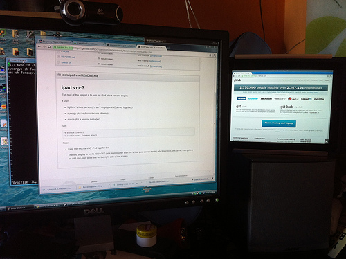

# ipad vnc?

The goal of this project is to turn my iPad into a second display.

It uses:

* tightvnc's Xvnc server (it's an X display + VNC server together)
* synergy (for keyboard/mouse sharing)
* notion (for a window manager)

use:

    % bundle install
    % bundle exec foreman start

The above command will run the X11+VNC server, window manager, and synergy.

Notes:

* I use the 'Mocha VNC' iPad app for this.
* The vnc display is set to 1024x767 (one pixel shorter than the actual ipad
  screen height) which prevents MochaVNC from putting an odd one-pixel white
  line on the right side of the screen.

I have found that this configuration is sufficient for running what I need (a
browser and a terminal). Mocha VNC is quite responsive! I was previously using
iSSH (which is an awesome SSH app) but it's VNC client is crazy slow to update.

Here's what it looks on the right side of my monitor, with this setup:

